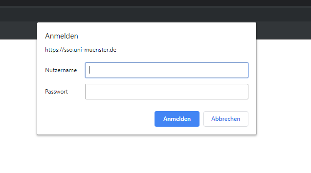
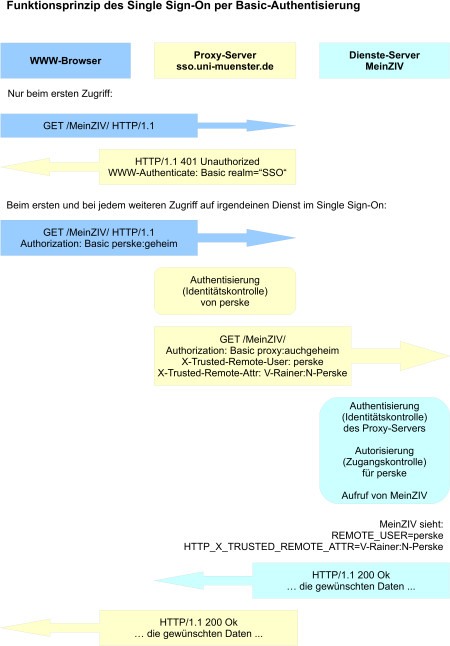

# Einer für alle(s)! Das SSO der WWU
SSO oder auch **S**ingle **S**ign **O**n (dt. Einmaliges Anmelden) ist eine Art der
Anmeldung bei der man sich nur einmal für alle verbundenen Dienste und Anwendungen
anmelden muss. Toll ist daran vorallem: das lästige Eingeben von Passwort und Benutzernamen
beim Wechseln zwischen einzelnen Diensten entfällt, das spart Zeit und Nerven.

# Verbreitung
Zahlreiche WWU Dienste bieten bereits die Möglichkeit das SSO zu nutzen. Dazu gehören zum Beispiel
die größeren Dienste wie meinZIV, das Learnweb oder der Maildienst perMail, aber auch über 50 andere oft
fachbereichspezifische Dienste.

# Nutzung
Um das SSO zu benutzen, ersetze einfach das `www` der URL eines Teilnehmenden Dienstes  durch `sso` zB wird\
`https://www.uni-muenster.de/LearnWeb/learnweb2/` zu `https://sso.uni-muenster.de/LearnWeb/learnweb2/`\
 das erste mal seit du deinen Browser geöffnet hast auf eine Seite mit SSO zugreifen willst so musst du dich
einmalig anmelden, danach bist du bei allen SSO Diensten angemenldet, bis du deinen Browser schließt.\

Viele Seiten bieten auch neben dem normalen Login Knopf einen speziellen SSO login Knopf.

# Hintergrundinformationen
Das Single Sign On funktioniert indem dem Browser vorgegaukelt wird alle Dienste befänden sich am gleichen Punkt, 
an `sso.uni-muenster.de`. Beim Besuch dieses Webspaces wird der User aufgefortdert sich mithilfe einer 
`Digest-Authentisierung` zu identifizieren. Diese Methode hat den Vorteil, dass alle Daten nur Clientseitig gespeichert
werden und zB ein Session Hjacking fehlschlägt, solange der Browser vertrauenswürdig ist. Spricht man nun eine andere
Seite in der Domäne an, so sendet der Browser die Authentifizierungsdaten direkt mit. Der angesprochene Server agiert
als Proxy, er identifiziert zunächst den angeforderten Dienst und dessen Server, überprüft dann die Identität des 
Servers und leitet erst hiernach die Authentifizierungsdaten des Nutzers weiter.\

Quelle : <a>https://www.uni-muenster.de/ZIV/Technik/WWW/Single_Sign_On.html</a>